# Chap.1 Bitriseの基本紹介
## ダッシュボード一覧
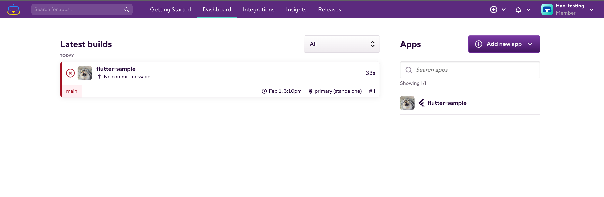
ログイン後、最初に表示される画面です。
- 右上のワークスペース名：選択したワークスペース名と使っているアカウントがそのワークスペースでの権限を表示しています。**v** を押すと所属しているワークスペースのリストと、アカウントのプロファイル設定画面とサポートセンタへのリンクなどが表示されます。
- Apps：ワークスペースに登録しているアプリ一覧
- Latest builds：各アプリの直近ビルド結果リスト
- Add new appボタン：アプリを新規登録するボタン
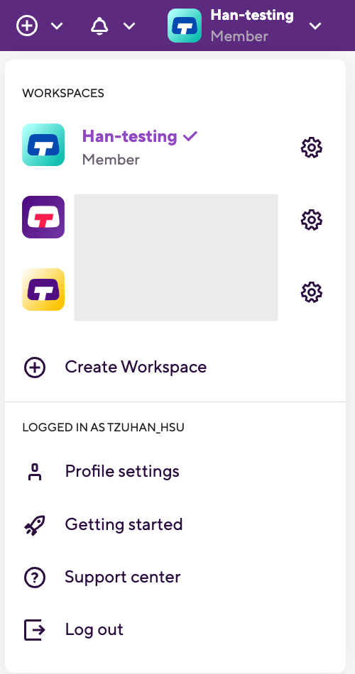

- Getting started: tuturial画面

- Support center: dev centerのドキュメント、Knowledge baseや、Community掲示板などのリンクが表示されます。
ビルド問題やフィーチャーリクエストなどの問い合わせがある場合は、こちらのsubmit a requestボタンをクリックし、メッセージを送っていただければ、我々customer support とTechnical supportチームが対応いたします。

## ワークスペース設定画面
ワークスペース名の隣のギアマークをクリックし、設定画面にいきます。
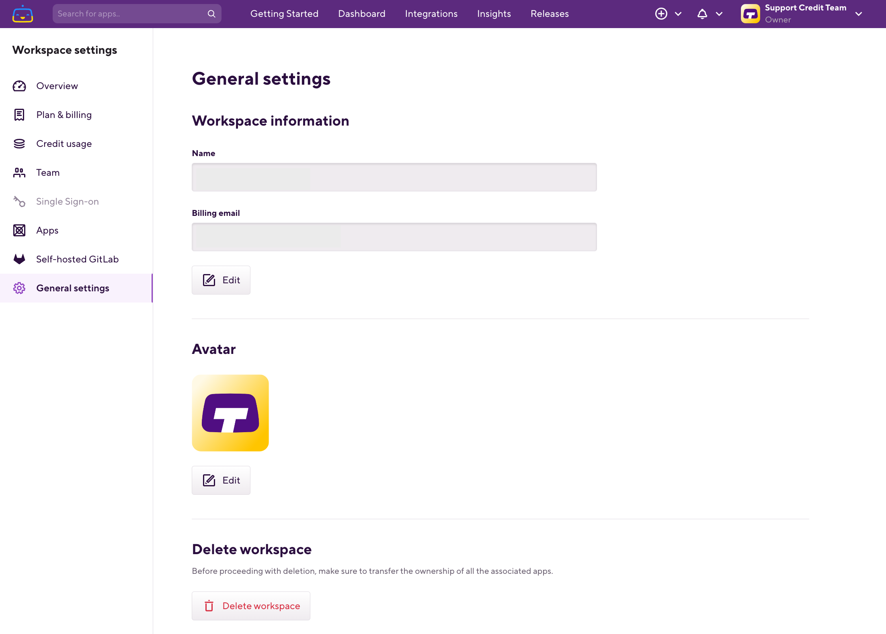
- Overview: 現状クレジット残数とワークスペースの概要
- Plan & Billing: 使用プランと請求書の情報
- Credit usage：各アプリ（CIプロジェクト）が使用したクレジット数
- Team：ワークスペースにアクセスできるユーザの権限管理画面です。
    - Members: ワークスペースにユーザの追加、削除。Add memberボタンをクリックし、メアドとグループを選択し、sent inviteをクリックすると、招待メールが届きます。
    - Groups:　ユーザグループの管理画面になります。各グループのメンバーリスト、ユーザ追加、削除、グループのアクセス権限の設定などができます。
    - Outside contributor：こちらはOutisde contributorの管理画面です。outside contributerはワークスペーに所属していない、アプリにだけアクセスできるユーザのことです。後ほどアプリの設定画面で詳しく説明します。
    - Owner: アカウントにOwner(Admin)権限の管理画面です。Owner権限を付与すると、ワークスペースやアプリの設定画面へのアクセスと請求書のアクセスができます。

- Single sign-on：Velocityプランお客様向けのSSO機能設定画面。[SSO設定詳細](https://devcenter.bitrise.io/en/accounts/saml-sso-in-bitrise.html)
- Apps：ワークスペースに登録したアプリリストが表示されます。ここでアプリを他のワークスペースへの移行と他のユーザに所有権を渡すことができます。
- Self-hosted Gitlab:社内で独自運用のGitlabサーバの関連設定
- General Settings: ワークスペース名と請求書の送信先の設定やワークスペース削除などの機能があります。

## プロファイル設定画面
Profile settingリンクをクリックし、アカウントのプロファイル設定画面にいきます。
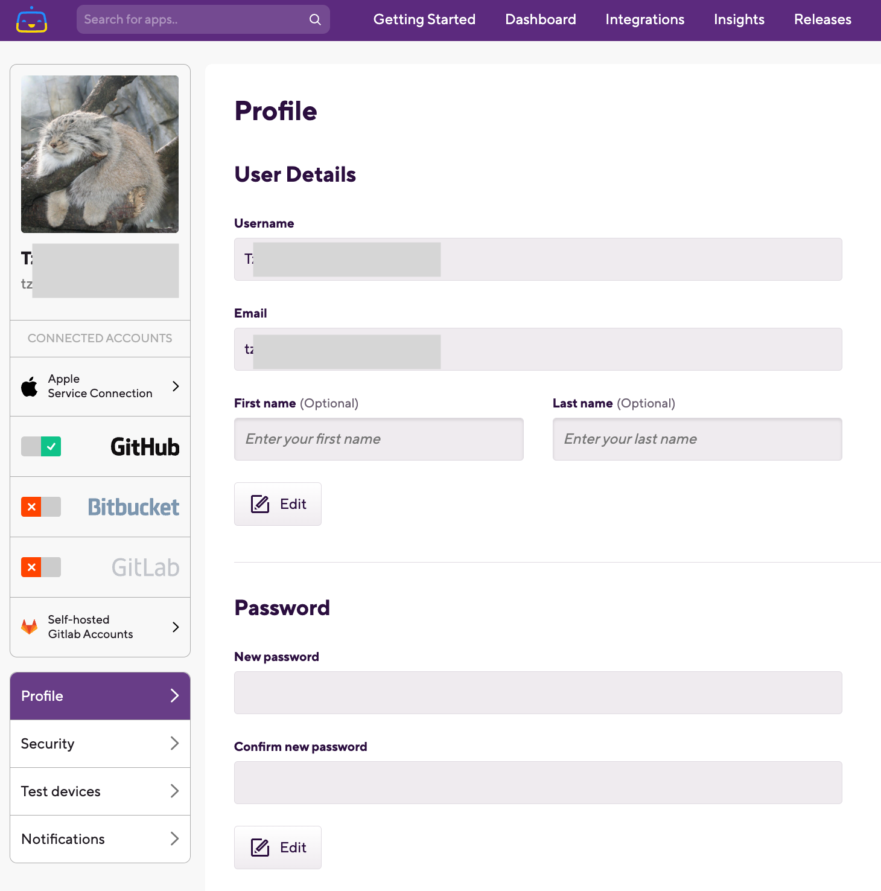
- AppleとGitHub/Bitbucket/Gitlabなどのソースコードホスティングサービスとの連携設定
- Profile：アカウント名、Emailアドレス、パスワードなどの設定
- Security：アカウントの2fa認証設定
- Test devices：このアカウントに紐づくテストデバイスの登録
- Notification：弊社からのニューズレターなどのメール通知設定

---

## ソースコードホスティングサービスとの連携
Bitriseを使用する際、ソースコードホスティングサービスとの連携が必要になります。
まずAdmin/ownersアカウントを用い、GitHub/GitLab/Bitbucketなどのソースコードホスティングサービスとの連携します。[社内で独自運用のGitlabサーバとの連携も可能です。](https://devcenter.bitrise.io/en/accounts/connecting-to-services/connecting-self-hosted-gitlab-instances.html)

Githubアカウントとの連携例を紹介します：
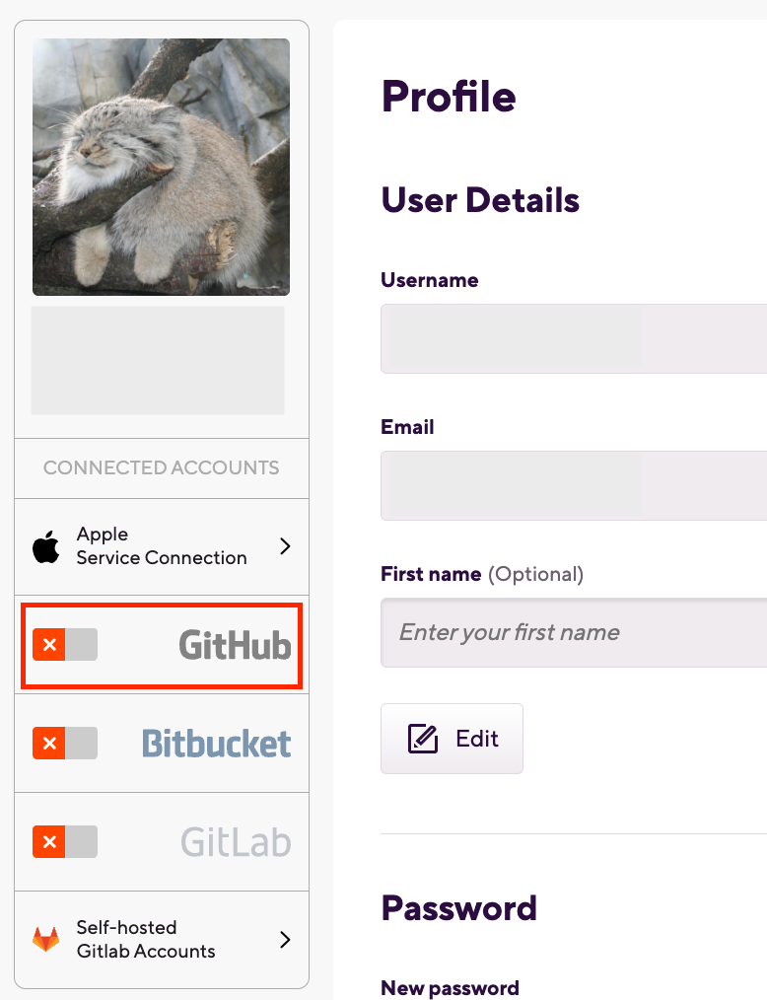
- プロファイル設定画面で、Githubの隣のトグルボタンをクリックし、Githubに遷移します。そしてBitriseのOAuth applicationに権限を付与します。
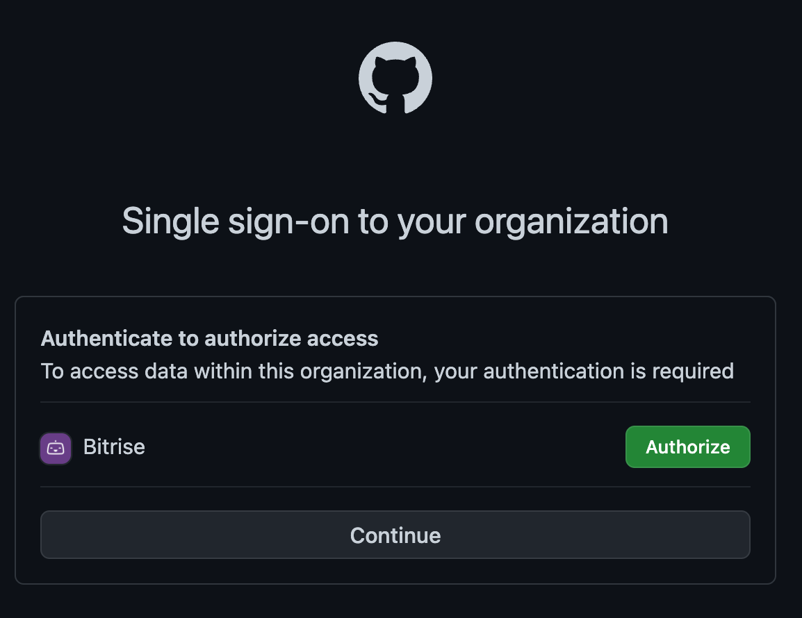
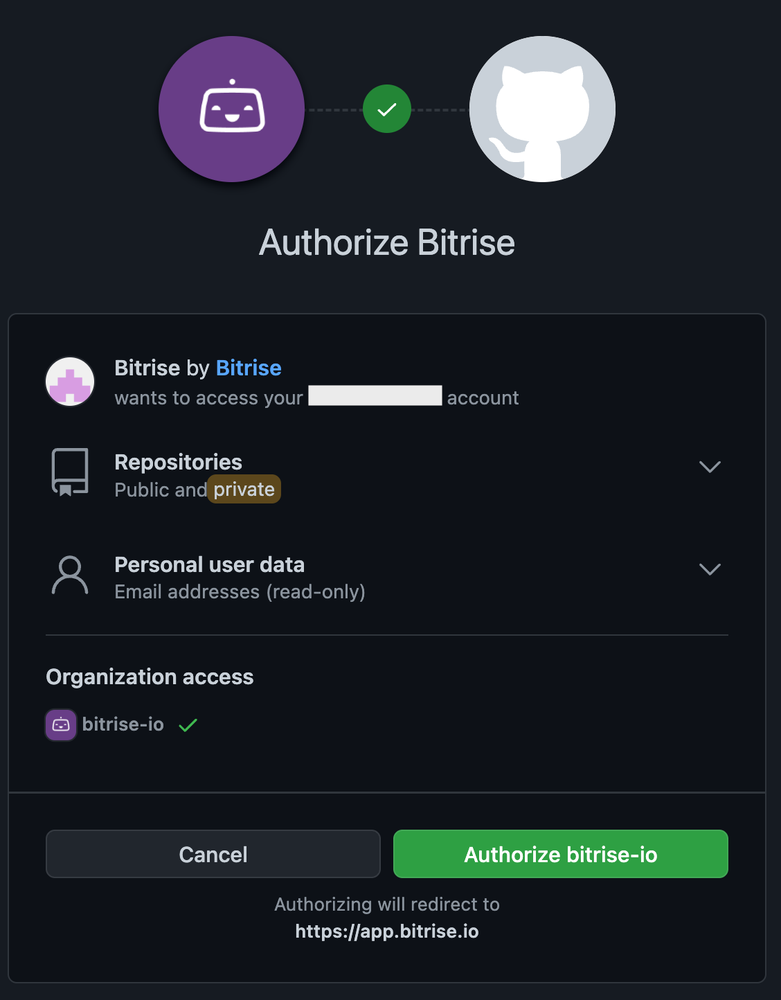
- 連携が完了したら、BitriseはGithubのレポジトリにアクセスでき、Webhookとsshキーの自動登録もできるようになります。

[他のホスティングサービスとの連携設定について](https://devcenter.bitrise.io/en/accounts/connecting-to-services/connecting-your-github-gitlab-bitbucket-account-to-bitrise.html)

---

## アプリ追加
続いて、ダッシュボード画面に戻り、最初のアプリを追加します。

- "Add new app"をクリックし→"Web CLI"を選択します。
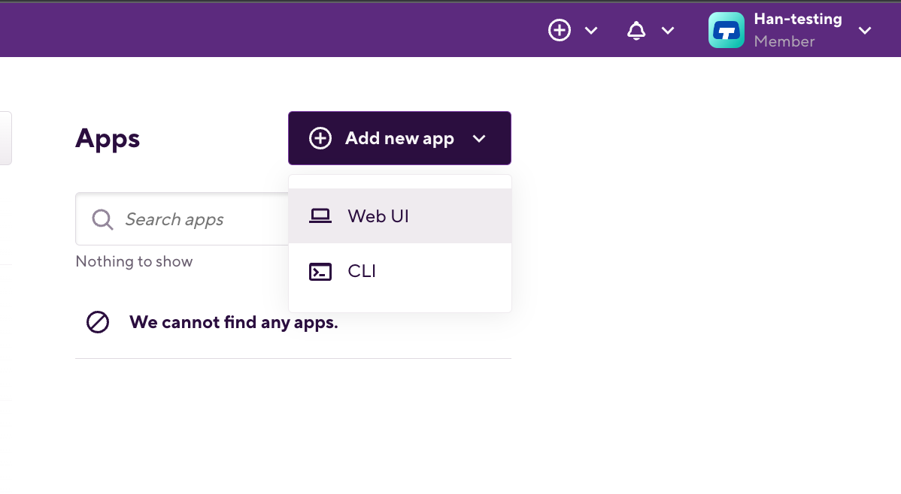
- アプリのプライバシーに **Private** を選択し、オンボーディング用のサンプルリポジトリを選択します。
Publicにした場合は、Build URLがあれば誰でもアクセスできるので、十分ご注意ください。
またPublicにしたアプリは、後ほどPrivateに変更できないので、削除してもう一度新規アプリの作成が必要になります。
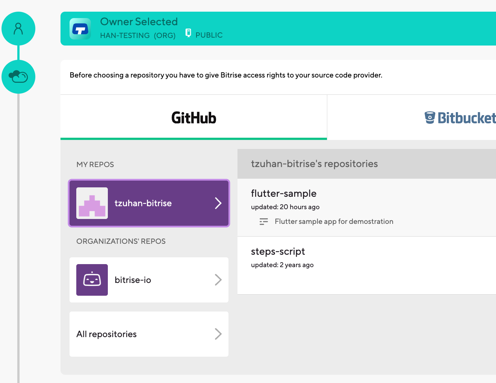
- ベースブランチ名を設定すると、プロジェクトの初期設定が自動的に行われます。
- build configurationを設定します。
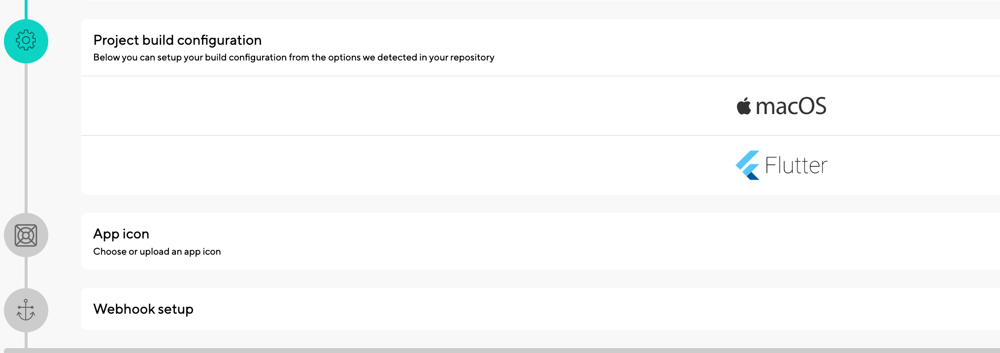
- Appアイコンを設定します。（ダッシュボートのアプリリストで表示するアイコンです、スキップ可能）
- Webhookを設定します。（スキップ可）
- 基本設定を完了し、右上のfinishボタンをクリックします。

そうするとアプリがダッシュボードに追加され、最初のビルドが走ります。

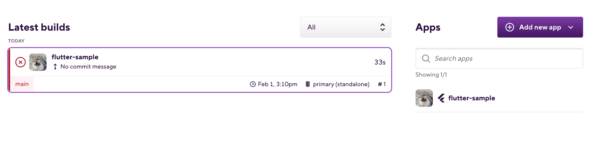

[最初のアプリ追加について](https://devcenter.bitrise.io/en/getting-started/adding-your-first-app.html)

---
## アプリ一覧画面
次にダッシュボードのアプリリストから、もしくは直近ビルドをクリックし、先ほど作ったflutter-sampleアプリに遷移します。

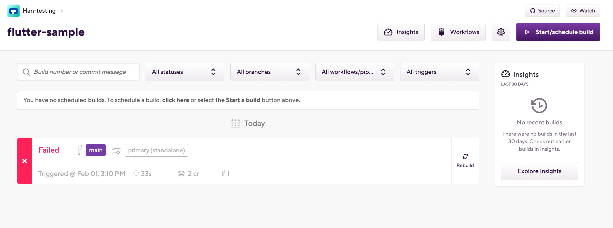

上にInsights(各ビルドデータの分析ツール)、ワークフローエディター、アプリ設定画面へのボタンがあり、紫のstart/schedule buildボタンが手動ビルド及びスケジュールビルド設定のボタンになります。

その下のビルド履歴部分は検索バーやビルドステータス、ブランチ名など、各種類のフィルターがあります。

## アプリ設定画面

- General
    - GitリポジトリのURLやデフォルトブランチの設定。
    - Bitriseテクサポートに調査してもらうビルド問題が発生した場合、Support Accessをオンにしていただく必要があります。
    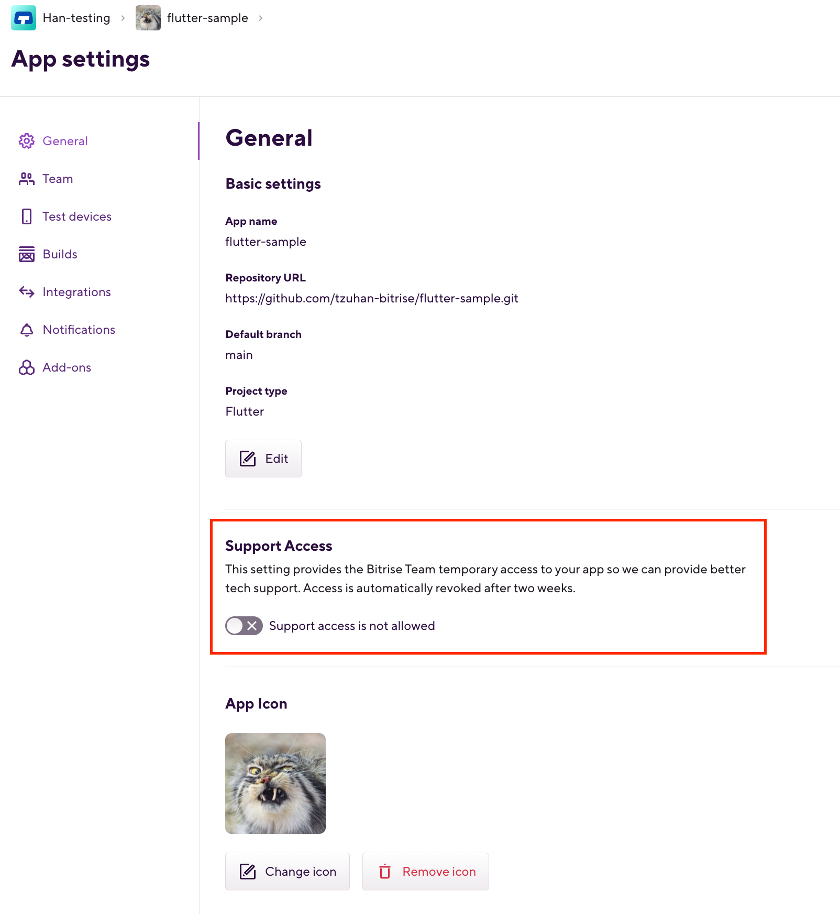
- Team
    - アプリにアクセスできるユーザとグループの管理画面。
    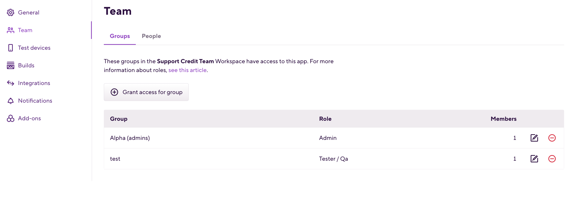
- Test devices：アカウントプロファイルに登録した端末リスト。
- Builds：ビルド設定やキャッシュの管理
- **Integration**：`Service credential user` の設定( Bitrise はこのユーザの認証情報を用い、gitホスティングサービスと通信します)と、
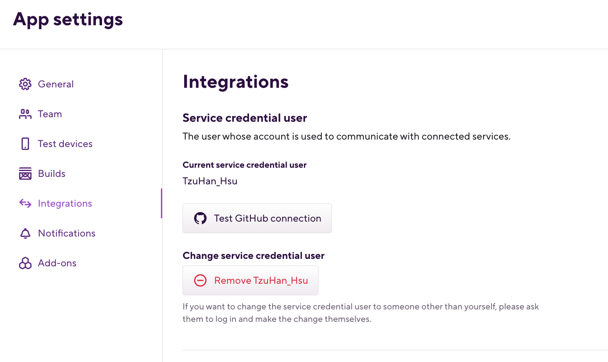
Appleサービスとの連携設定（API Key, Apple ID)、Github Checks、Webhookの設定など
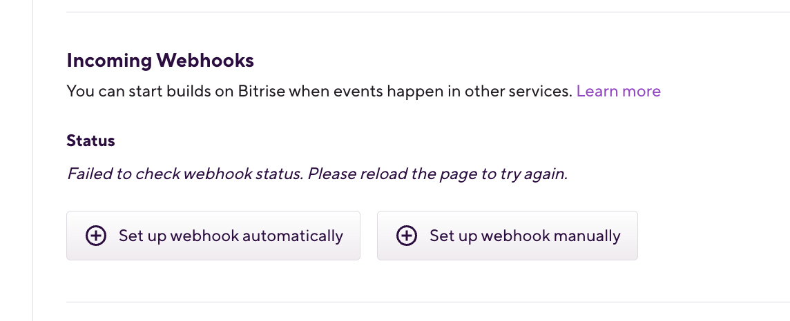

- Notifications：ビルド成功/失敗のEmail通知設定（Slack通知はワークフロー内で設定します）
- Add-on：Bitriseが提供するAdd-onの設定

### ビルド履歴リスト
各ビルド結果の情報は簡潔にまとめられています。

例：
- 失敗ビルド
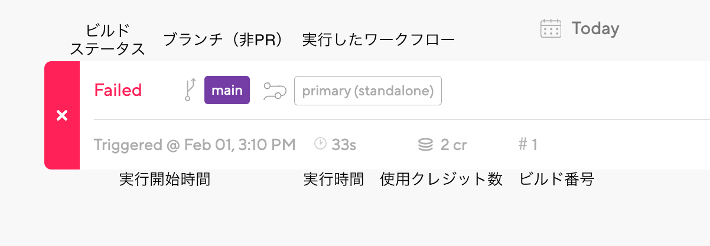
- 成功ビルド (PR)
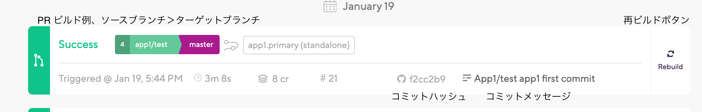
- 成功ビルド (Push)
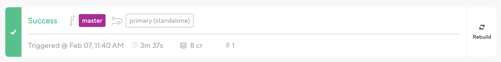
- 停止ビルド
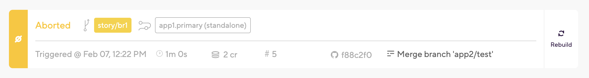

ビルドをクリックすると、ビルドの詳細画面に行きます。

---
## ビルド詳細画面

右上に
- ワークフローエディターへのリンクボタン
- ビルドログのダウンロード
- bitrise.ymlファイル表示
- 再ビルドボタン

ビルド結果情報と下の四つタブがあります：
- ビルドログ：各ステップの実行結果
- Artifacts（エラーログ、テストレポート、ビルド生成物ファイル(app bundle、ipaなど）、- Details & Add-ons：ビルドの詳細情報及びTest reports、ShipなどのAdd-onへのリンク
- Tests：Test reportsへのリンク

以上が大まかのダッシュボードUIの紹介、続いてワークフローエディターを紹介します。

# ワークフローエディター画面
**Edit workflow**をクリックし、ワークフローエディターに遷移します。
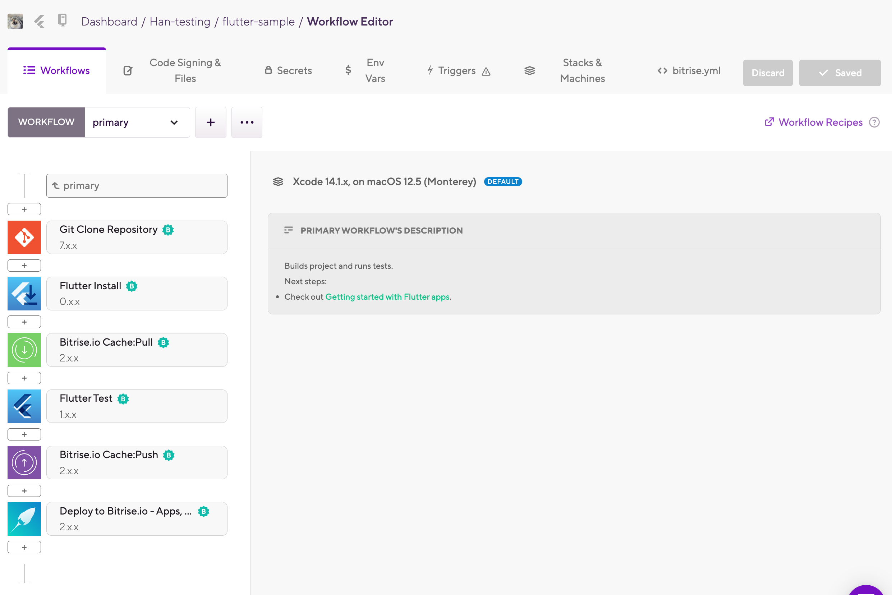

まず、一番上のタイトルバーからワークスペース一覧画面とアプリ一覧画面へのリンクがあります。
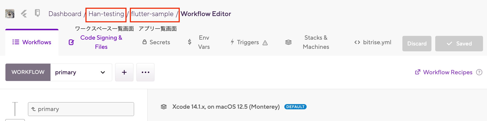

下のタブを紹介します：
- Workflows：ワークフローの編集画面
- Code signing & Files：iOSのProvisioning Profile、Certificat証明書(P8とP12)、Androidのkeystoreファイル、または他ビルド用に必要なファイルの管理画面。（サードパーティのVaultサービスを使用している場合はこちらを使う必要がない）
- Secrets：シークレット変数（例えばパスワード、サードパーティサービスが発行したトークンなど）の設定画面
- Env Vars：環境変数の設定画面、ワークフローごとに設定可能です。
- Triggers：トリガールールの設定画面、Push、Pull Request、Tag三種類のトリガールール設定可能です。
- Stacks & Machines：ビルドスタック及びマシーンの選択画面。ワークフローごとに設定可能です。
- bitrise.yml：このプロジェクトの設定ファイルです。Code Signing/Secretsを除くすべて設定をYAML形式で記述されます。こちらの画面で直接編集できます。

## ステップ
Bitriseの基本になります。各種のビルドタスクを「ステップ」と呼びます。
ステップは三種類があります：

- 公式のBitriseステップ：Bitriseによって作成および保守されるステップです。緑の「B」のラベルが付いたバッジが付いています。
- [Verified Step (検証済みステップ)](https://devcenter.bitrise.io/en/steps-and-workflows/developing-your-own-bitrise-step/verified-steps.html#what-are-verified-steps-)：コミュニティによって作成および保守されていますが、サードパーティーが「Verified Step Program」に参加していて、安全性、高品質のパフォーマンスなどが保証されるステップです。青のチェックマークのバッジが付いています。
- コミュニティステップ：コミュニティによって作成および保守されるステップです。

基本的にワークフローを作る時、ステップライブラリーから最適の既存ステップを使いますが、自分用のCICDワークフローに適したカスタムステップを作ることもできます。

[ステップの詳細ドキュメント](https://devcenter.bitrise.io/en/steps-and-workflows/introduction-to-steps.html)

## ワークフロー
ステップの集まりです。

ビルドする際、選択したワークフロー内のステップは順番に実行されます。

### ワークフローの管理
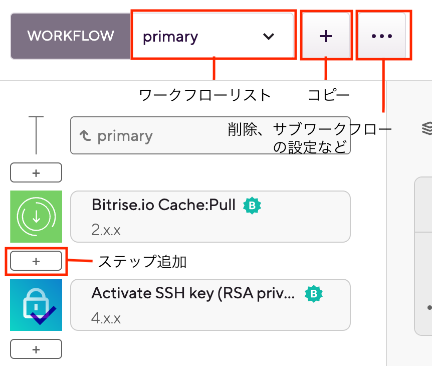

### PrimaryとDeployワークフロー
プロジェクトの初期段階で作成されるワークフローです。
基本的にこちらをベースにして、新規ワークフローを作成します。[詳細](https://devcenter.bitrise.io/en/steps-and-workflows/introduction-to-workflows/default-workflows.html)

Flutterなどのクロスプラットフォームプロジェクトに対し、Android/iOSビルド用のワークフローを分けなくても大丈夫ですが、今回は機能説明のため別々にします。

まず、Primaryワークフローををベースにして、Android/iOSワークフローを新規作成します。
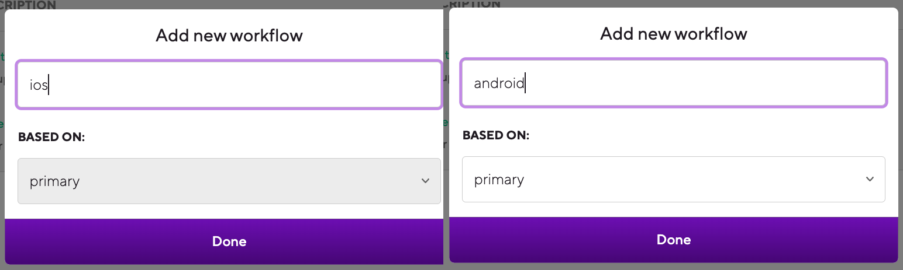

最初のビルドが失敗した理由は、使用したFlutterバージョンがプロジェクトの最低SDKバージョンより古かったため、
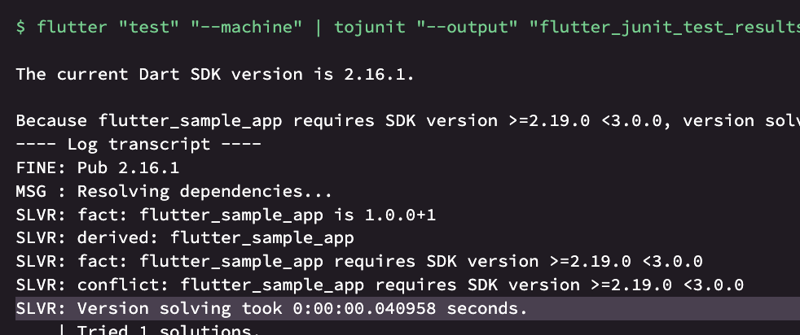

左側のワークフローのFlutter Install ステップを選択し、Flutter SDK versionを変更します。
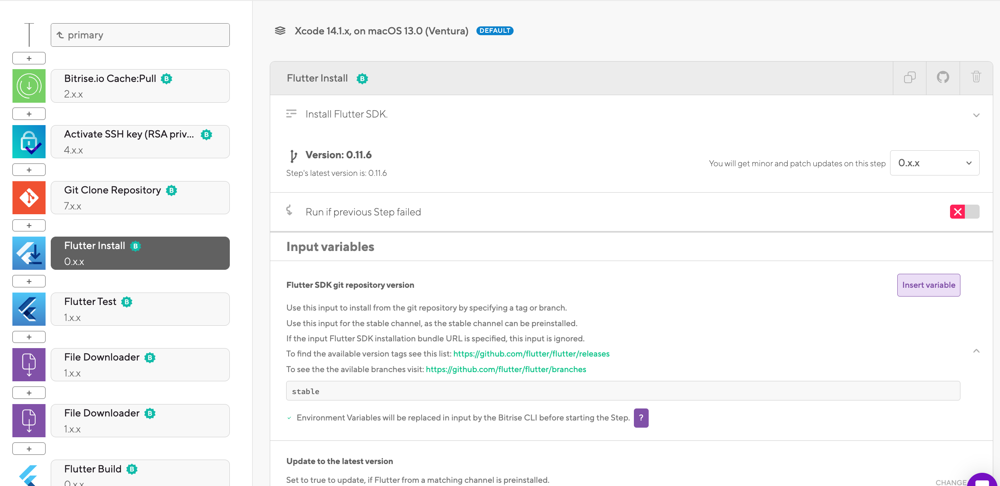
stableから `3.7.0` (Dart 2.19.0)に変えて、セーブします

また、Flutter Buildステップを成功させるには、Android、iOSのCode signingの設定をしなければなりませんので、第二回のセッションでCode signingについて詳しく説明しますので、今はこのステップを削除してビルドします。

### ステップの削除方法
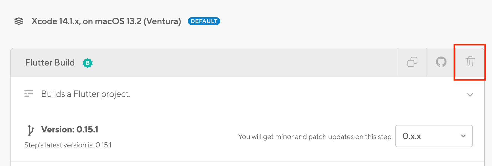

ビルド成功！
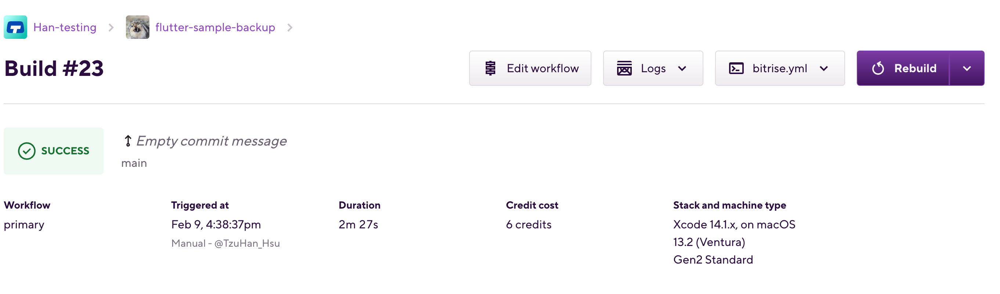

[詳細](https://devcenter.bitrise.io/en/getting-started/getting-started-with-flutter-apps.html)

