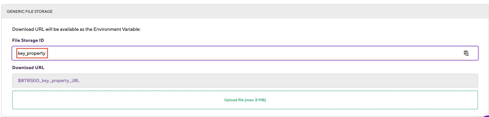
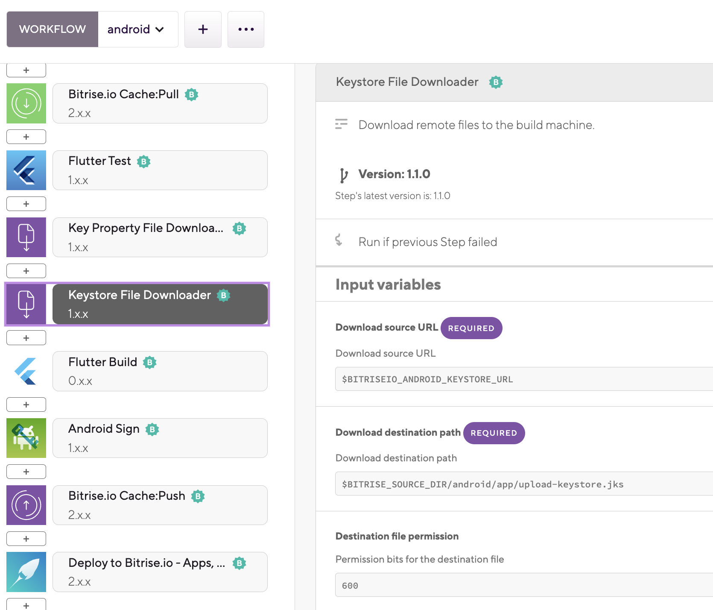
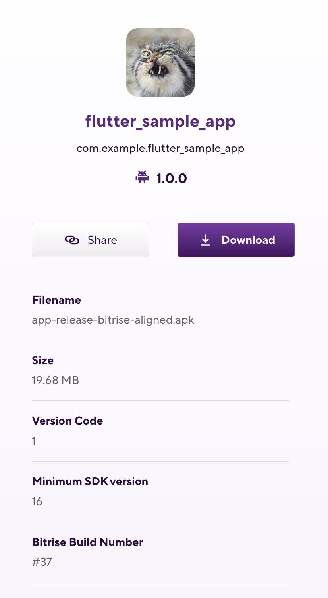
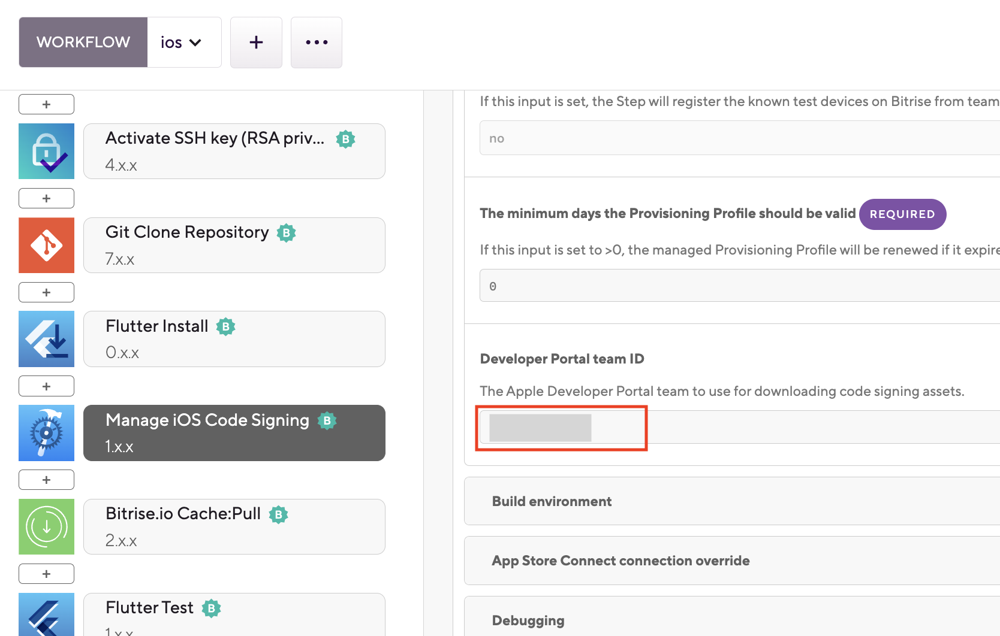

# Chap.2 ワークフローエディター

# bitrise.yml
プロジェクトのYAML設定ファイルの保存できる場所は二つ：
- Bitriseで保存
    - メリット：ファイル統一性、保存時に自動的にyaml lint（シンタックスチェック）が走ります。
    - デメリット：ワークフローエディターでしか変更できません。
- レポジトリに保存
    - メリット：ブランチごと違うYAMLの使用が可能（アプリ設定画面のベースブランチの変更が必要）、ローカルで変更可能
    - デメリット：ワークフローエディターでの編集を手動でGITに上げなければ反映しません。

今回はAndroidとiOSアプリのビルドワークフローを引き続き作ります。
Apkやipaを作成するには、コード署名の証明書が必要になります。
# Androidビルドワークフロー

## 署名書設定
まず、Android用のコード署名用証明書を用意します。
[Androidコード署名について](https://developer.android.com/studio/publish/app-signing?hl=ja)
- upload-keystore.jks　(キーストア）
- key.properties　（keyPassword, keyAliasなどの署名情報を含めるpropertiesファイル）


この二つのファイルをCode signing & Filesタブにアップロードします。

キーストアファイルを **Android Keystore File** に登録します。


登録したKeystore Passwordや Keystore Aliasが自動的に相応の環境変数に設定されます。
- Keystore Password：`$BITRISEIO_ANDROID_KEYSTORE_PASSWORD`
- Key Alias: `$BITRISEIO_ANDROID_KEYSTORE_ALIAS`
- Private Key Password: `$BITRISEIO_ANDROID_KEYSTORE_PRIVATE_KEY_PASSWORD`

下の **Show Password?** トグルボタンをクリックすると、登録したパスワードを一時的にUIから隠せます。
または右の **...** → **Make Protected** ボタンをクリックすると、登録した情報を暗号化し、修正できないようにすることも可能です。

続いてkey.propertiesを **Generic File Storage** に登録します。

File Storage IDに**key_property** を指定します。

登録したファイルのURLは環境変数`$BITRISEIO_key_property_URL`として登録されます。


## ワークフロー設定
証明書登録したら、`File Downloader`というステップを入れて、マシーンに登録したキーストアファイルとkey.propertiesファイルを置きます。
key.properties内で定義した相応パスに従ってキーストアファイルを配置します。


### key.propertiesの配置
- Download Source URL: `$BITRISEIO_key_property_URL`
- Destination path: `$BITRISE_SOURCE_DIR/android/key.properties`
- ファイル権限: 644

### キーストアファイルの配置
- Download Source URL: `$BITRISEIO_ANDROID_KEYSTORE_URL`
- Destination path: `$BITRISE_SOURCE_DIR/android/app/upload-keystore.jks`
- ファイル権限: 600


bitriseに登録せず独自のVault(シークレット管理サービス)で証明書を管理する場合、Download Source URLを相応のURLに変更します。

次にFlutter build ステップをに追加します。
- Platform: android
- Android output Artifact type: apk


次にAndroid Signステップを追加し、`Enables apksigner`を`true`にしてセーブします。


アプリ一覧画面に戻り、ビルドを実行します。
生成したApkはArtifactsタブでダウンロードできます。
- `app-release.apk`：Flutter buildステップで生成したApk
- `app-release-bitrise-signed.apk`：署名したApk
- `app-release-bitrise-aligned.apk`：zipalignを使用した署名後のApk




# iOSビルドワークフロー
まず、iOS用のコード署名証明書とプロビジョニングプロファイルを用意します。
このデモでは開発用証明書を用いて説明します。
[開発用コード署名証明書（iOS App Development）p12の作成方法](https://i-app-tec.com/ios/apply-application.html)
[開発用のプロビジョニングプロファイルの作成方法](https://developer.apple.com/jp/help/account/manage-profiles/create-a-development-provisioning-profile/)
ちなみに証明書の発行はApple Developer Programに加入しているデベロッパーアカウントユーザしかできません。

BitriseでFlutterプロジェクトのiOSコード署名方法は下記になります：
- bitriseアカウントにApple Developer Portal との連携が必要
- Xcodeで`Team`を設定
- 作成したプロビジョニングプロファイルと証明書を`Code Signing & File`タブに登録
- `Certificate and profile installer`というステップで登録した証明書をマシンにダウンロード
- 自動プロビジョニングをサポートしているステップを使用

## Apple Developer Portal との連携
Bitrise Admin/Ownerアカウントを用い、BitriseにApple Developer Portal アカウントと連携します。


### [App Store Connect APIキー認証](https://devcenter.bitrise.io/en/accounts/connecting-to-services/connecting-to-an-apple-service-with-api-key.html)


Bitriseが一番推奨の連携方法。[APIキーの作成方法](https://developer.apple.com/documentation/appstoreconnectapi/creating_api_keys_for_app_store_connect_api)
- メリット：APIキーには期限がないため、更新必要ありません。
- デメリット：APIキーの発行はApple のAdmin Developerアカウントが必要です。さらに、APIキーはApple Store Connect内全てのアプリにアクセスでき、特定のアプリに限定することはできません。

### [Apple ID認証](https://devcenter.bitrise.io/en/accounts/connecting-to-services/connecting-to-an-apple-service-with-apple-id.html)

もしAPIキー使えない場合、App Store Connect Apple ID/パスワードでも連携できます。
- デメリット：30日ごとに手動で再認証が必要。


次に、アプリ設定画面 → Integrationsタブ → **Connection to Apple services** にApple service authenticationが設定されていることを確認します。


（Test connectionで接続テスト）

## Xcodeでコード署名の設定
FlutterサンプルアプリのXcodeプロジェクトを開き、メインターゲット→Signing & Capabilitiesタブに、
Teamを自社のApple Developerチームに変更します。
`Automatically manage signing` をチェックします。
プロビジョンニングプロファイルは`Xcode Managed Profile`になっていることを確認します。


## 証明書登録
プロビジョンニングプロファイルとコード署名証明書P12をCode Signingタブに登録します。


## ワークフロー設定
ワークフローに`Certificate and profile installer`ステップを追加します。

---
## 追記
FlutterプロジェクトでもiOSの自動プロビジョンニングプロファイル機能が使えます。

自動プロビジョンニングプロファイル機能を使用するには、`Certificate and profile installer`ステップを削除し、`Manage iOS Code Signing`ステップを使用します。

- Connection method：apple-id
- Project path: `$BITRISE_IOS_PROJECT_PATH`、 `Xcode Archive & Export for iOS` ステップで指定した変数と一緒
- Scheme: `$BITRISE_IOS_SCHEME`、 `Xcode Archive & Export for iOS` ステップで指定した変数と一緒

- Developer portal team ID: Apple accountが複数のチームに所属している場合、teamIDの指定を忘れずに！


---


`Flutter Test`ステップの後ろのに`Flutter Build`ステップを追加します。
- Platform: ios
- Artifact type: app
に指定します。
app: 開発用, .ipaを作成
archive：本番用、.appを作成、本番用の証明書が必要


次に`Xcode Archive & Export for iOS`ステップを追加します。

入力変数の名前を変更します。
- Project path: `$BITRISE_IOS_PROJECT_PATH
- Scheme: `$BITRISE_IOS_SCHEME
- Automatic code signing: Apple-id(使用した連携方法を選択）

EnvVarタブに移動し、先ほどXcode Archiveステップで使う環境変数を定義します。


アプリ一覧に戻り、ビルドします。

### ビルド結果

Runner.ipa: 生成ipaファイル


# Script ステップ


カスタムのシェルスクリプト(Bash)を入力ブロックに入れると、ビルド時に実行されます。
環境変数の内容を出力したり、[動的に環境変数の設定](https://devcenter.bitrise.io/en/builds/environment-variables.html#setting-and-managing-env-vars-during-a-build)したりすることができ、ワークフローをデバッグする時すこく便利です。

```
envman add --key MY_VARIABLE --value "variable value"
```

# [ステップのスキップ](https://devcenter.bitrise.io/en/steps-and-workflows/introduction-to-steps/skipping-steps.html)

`Run in previous Step failed`トグルボタンをオンにすると、前のステップが失敗しても、ビルドが続きます。
# [条件付きでステップを有効化または無効化](https://devcenter.bitrise.io/en/steps-and-workflows/introduction-to-steps/enabling-or-disabling-a-step-conditionally.html)
`run_if`、`is_skippable`、`is_always_run`などの条件と`.IsCI`、`.IsBuildFailed`などフラグを用い、より複雑のワークフローが実現できます。
# [ステップの制限時間設定](https://devcenter.bitrise.io/en/steps-and-workflows/introduction-to-steps/setting-a-time-limit-for-steps.html)
ステップごとの制限時間`timeout`（秒数）を指定できます。
```
- xcode-test@1.18.14:
     timeout: 120
     inputs:
     - project_path: "$BITRISE_PROJECT_PATH"
     - scheme: "$BITRISE_SCHEME"
```
オススメです。

# [ステップが一定時間出力ログがない場合によるビルドを自動停止機能](https://devcenter.bitrise.io/en/steps-and-workflows/introduction-to-steps/detecting-and-aborting-hanging-steps.html)
ビルドハングを防ぐため、任意のステップが一定時間に出力ログがない場合、自動的にビルドを停止する機能です。
消費クレジットを抑えるため、オンにすることをお勧めします。
- シークレットタブに、`BITRISE_NO_OUTPUT_TIMEOUT`という変数を登録し、閾値秒数を設定します。


# [カスタムステップについて](https://devcenter.bitrise.io/en/references/steps-reference/step-reference-id-format.html)
自作のステップを使用する場合のノウハウ。
# チェインニングワークフロー
重複している部分をサブワークフローとして抽出すると、今後修正する場合は楽になります。
[チェインニングワークフロー詳細](https://devcenter.bitrise.io/en/steps-and-workflows/introduction-to-workflows/)

例：Git CloneからFlutter Installまで抽出し、`setup-environment`というワークフローを作ります。

他のワークフローと繋げます。


# トリガー設定
まず、プッシュ、プールルクエスト（PR）のWebhookトリガーを設定します。

## [Incoming webhook setup](https://devcenter.bitrise.io/en/apps/webhooks/adding-incoming-webhooks.html)

アプリ登録した時、`Setup Webhook Automatically`を選択したので、
すでにWebhookは登録されているはずです。

App設定画面 → **Integration**タブ→ **Incoming webhooks** にincoming webhookが自動設定されているはずです。


GitHubのAdmin/Ownerアカウントを用い、Webhookを登録します。

**Edit**をクリックし、Webhookイベントに`Pushes`と`Pull requests`がチェックされていることを確認。

Webhook **Recent Deliveries**をクリックし、Webhook履歴をオンにします。（Webhook不具合の調査に必須）


[GitHub設定詳細](https://devcenter.bitrise.io/en/apps/webhooks/adding-a-github-webhook.html)

## [Outgoing webhook](https://devcenter.bitrise.io/en/apps/webhooks/adding-outgoing-webhooks.html)
Bitrise側からのWebhookも登録可能です。

## [トリガーマップを設定](https://devcenter.bitrise.io/en/builds/starting-builds/triggering-builds-automatically.html#triggering-builds-with-code-push)

ブランチ名のマッチングにWildcard(*)を用いてパターン化可能。[Wildcardについて](https://devcenter.bitrise.io/en/builds/starting-builds/using-the-trigger-map-to-trigger-builds.html#using-wildcards-in-the-trigger-map)


（現状では、Wildcard以外の正規表現機能は備わっていません。）

