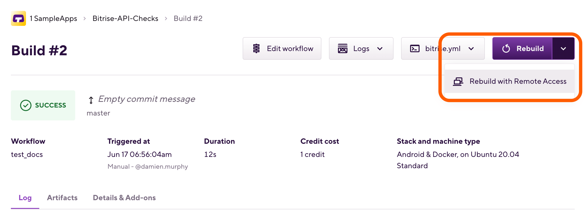
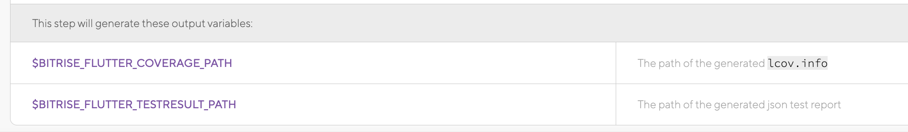

# デバッグとテスト

- [start/schedule buildとRebuildボタンの紹介](https://devcenter.bitrise.io/en/builds/environment-variables.html#setting-a-custom-env-var-when-starting-a-build)
# [リモートアクセス](https://devcenter.bitrise.io/en/builds/build-data-and-troubleshooting/remote-access.html)

リモートアクセス機能とは、SSH接続やScreenshare接続（VNCシステム、Xcodeスタックのみ）でビルドマシーンに接続する機能です。

ビルド開始〜完了後の１０分以内で接続可能。[接続の期間を延ばす方法](https://devcenter.bitrise.io/en/builds/build-data-and-troubleshooting/remote-access.html#remote-access-with-ssh)

Tester/QA権限以外のユーザはリモートアクセス機能が使えます。

Rebuildボタンの矢印をクリックして、`Rebuild with Remote Access`を選択します。

SSH接続に使うコマンドとパスワードと、VNC接続（Screenshareとか）に使うアドレス、ユーザ名とパスワードなどの情報が表示されます。


# [Bitrise CLI](https://app.bitrise.io/cli)
もう一つワークフローのデバッグに役に立つツールは**Bitrise CLI**です。
ローカル環境でワークフローを実行したり、

CLIのインストール
```
brew update && brew install bitrise
```
ローカルでワークフローの実行方法
- アプリのbitrise.ymlをローカルに置きます
- コマンド`bitrise run <ワークフロー名>`で実行します。
ビルドが失敗する時、デバッグの際、


[詳細](https://devcenter.bitrise.io/en/bitrise-cli.html)

ローカルのDocker環境でビルドを実行する
https://devcenter.bitrise.io/en/infrastructure/running-your-build-locally-in-docker.html


# テスト

## Flutter analyzer
[Flutter Analyzeステップ](https://devcenter.bitrise.io/en/steps-and-workflows/workflow-recipes-for-cross-platform-apps/-flutter--run-dart-analyzer.html)でflutterプロジェクトのFlutterの静的解析（Dart Analyzer & Linter）をします。
（`analysis_options.yaml`ファイルにAnalyzerのルール定義が必要です。）
[参照](https://tech-blog.rakus.co.jp/entry/20210518/flutter)

# [Flutterテスト](https://devcenter.bitrise.io/en/getting-started/getting-started-with-flutter-apps.html#testing-a-flutter-app)
FlutterのUnit、Widget、Integrationテストは全部このFlutter testのステップで実行できます。

- Step's test result directory:テスト結果ファイルの格納場所、Deploy to Bitrise.io ステップを追加すると、結果は**Artifactタブ**に格納されます。

- Generate code coverage files: コードカバレッジは自動作成できます。
- Additional parameter:　flutter testコマンドで追加のパラメータ入力できます。

テスト結果とコードカバレッジファイルパスはステップ詳細の下の環境変数に設定されます：


[Flutter 結合テストについて](https://docs.flutter.dev/testing/integration-tests#project-setup)

# デバイステスト
Bitriseでは[Firebase Test Lab](https://firebase.google.com/docs/test-lab)というクラウドベースのアプリテストプラットフォームてデバイステストを行っています。
## [iOSデバイステスト](https://devcenter.bitrise.io/en/testing/device-testing-for-ios.html)

ワークフローに**Xcode Build for testing for iOS**ステップと**iOS Device Testing**ステップを追加します。

- Project Path: Xcodeworkspaceのパス
- Scheme：iOSプロジェクトのスキーム
- Device Destination：デバイスDestination、ローカル環境でコマンド：`xcodebuild -showdestinations -workspace Runner.xcworkspace -scheme Runner` で一覧が見れます。
```
$ xcodebuild -showdestinations -workspace Runner.xcworkspace -scheme Runner

User defaults from command line:
    IDEPackageSupportUseBuiltinSCM = YES

--- xcodebuild: WARNING: Using the first of multiple matching destinations:
{ platform:iOS Simulator, id:6D25E324-807F-451C-87EF-1442C0642954, OS:16.2, name:iPhone 14 Pro }
...
```

- Automatic code signing methodの設定も忘れずに。


**iOS Device testing**ステップにテストデバイスの設定をします。クリックすると、サポートしているデバイス一覧が見れます。

### 制限
- ワークフローに一つ**iOS Device Testing**ステップしか登録できません。シミュレーター数を一台に設定していただくことを推薦します。
- Firebase test labでは **XCTest** のテスト項目のみ実行します。

## 結果
 Details & Add-ons タブ→**Test Reports**をクリックします。

 Test Summary タブでテスト結果一覧が表示されます。

## [Androidデバイステスト](https://devcenter.bitrise.io/en/testing/device-testing-for-android.html)
Bitriseの方では、三種類のテストをサポートしています：
- robo (デフォルトのテストタイプ)
- instrumentation
- gameloop

[テストタイプについて](https://firebase.google.com/docs/test-lab/android/get-started)

Android Signステップの後ろに、
**[BETA] Virtual Device Testing for Android**ステップを追加します。

- App Path：Android Signステップで出力したApk/Aabファイルのパス
- Test Devices：テストデバイス名を指定します。（クリックすると一覧が表示されます。）

### 結果
同じくDetails & Add-ons タブ→**Test Reports**でテスト結果が確認できます。
# oAuth認証必要の場合のテスト
アプリのテスト結果がoAuthサーバーの安定性に影響させないため、
- あらかじめに有効なoAuthトークンを用意する(scriptでoAuthサーバーにリクエストし、保存する)
- テスト用のMock oAuthサーバーを使う
ことをお勧めします。
[参照1](https://softwareengineering.stackexchange.com/questions/413182/store-oauth-2-0-tokens-for-use-in-testing-and-ci-cd)
[参照2](https://dev.classmethod.jp/articles/testing-oauth2-with-requests_mock/)
# 2要素認証テスト
CICD環境ではユーザインタラクションができないので、2要素認証はと相性が悪いです。[詳細](https://stackoverflow.com/questions/66221323/how-to-run-the-server-less-deploy-in-ci-cd-command-when-it-needs-mfa)

# API関連のテスト
oAuthと同様、APIサーバーの安定性に影響させないため、[Mock API](https://stackoverflow.com/questions/55409978/how-to-mock-http-request-in-flutter-integration-test)の使用を推薦します

例：Mockitoパッケージを用いて、仮http.ClientクラスでAPIに関わる部分をテスト。
https://docs.flutter.dev/cookbook/testing/unit/mocking

# 位置情報関連のテスト
## Android
[参考１](https://github.com/Navigine/Android-Fake-Mock-Location-Tricks)
[参考２](https://betterprogramming.pub/how-to-fake-your-location-programmatically-and-avoid-being-tracked-by-companies-37447ec8f740)
## iOS
[参考１](https://developer.apple.com/documentation/xcode/simulating-location-in-tests)
[参考２](https://itnext.io/simulate-debugging-location-in-ios-24496cbbc9d9)
GPXファイルを用いて、偽位置情報を設定します。
Appleは、開発におけるGPXファイルの使用を制限しています。実機またはシミュレータを接続し、Xcodeで実行したときのみ、位置情報をシミュレートすることができます。つまり、テスト用の位置情報をCI/CDでQAテスターに配信することはできません。


# 現在時刻に依存するテスト
https://macosx-faq.com/how-to-change-date-time-terminal/
[Set MacOS Time Zone](https://www.bitrise.io/integrations/steps/set-macos-timezone)というコミュニティーステップを使用、もしくはスクリプトステップでタイムゾーンの設定を変更したり、時間を設定したりすることができます。
例：
```
sudo systemsetup -settimezone <Timezone/Name>
```

# 音声関連のテスト
弊社が使用している仮想化ソリューション（VMware vSphere）は、主に高性能なサーバ仮想化を目的としているため、
サウンド出力はほとんど意味がなく、Macスタックには内蔵のオーディオ出力はありません。
オーディオ出力が必要な場合は仮想オーディオ出力デバイスを追加する必要があります。
[詳細](https://discuss.bitrise.io/t/how-to-create-a-virtual-audio-output-device-on-mac-os-stacks/1119)

お勧めのライブラリー：[BlackHole](https://github.com/ExistentialAudio/BlackHole)
オープンソースのmacOS仮想オーディオループバックドライバで、
アプリケーションから他のアプリケーションに、追加のレイテンシなしでオーディオを渡すことができます。

```
set -ex
brew cask install blackhole
brew install switchaudio-osx

SwitchAudioSource -s "BlackHole 16ch" -t input
SwitchAudioSource -s "BlackHole 16ch" -t output
```

2. Soundflowe（M1未対応）
```
brew install --cask soundflower
```
ライブラリのGitリポジトリ：https://github.com/Homebrew/homebrew-cask