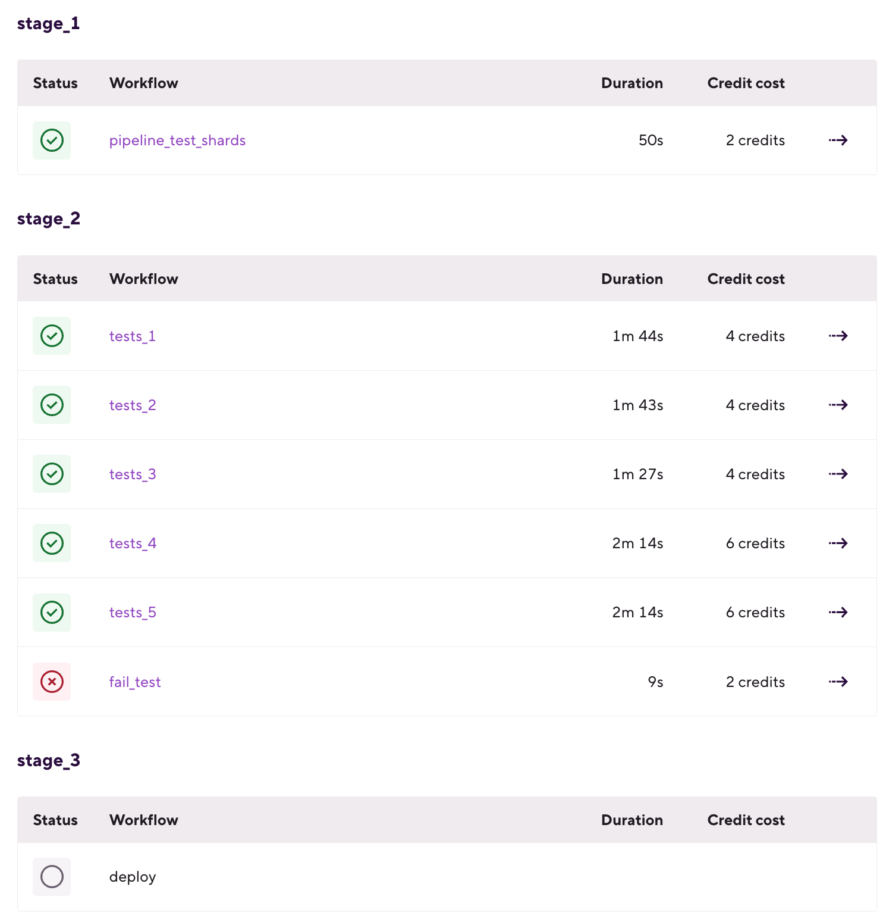

# ビルドとパイプライン

# お知らせ
2月28日から、M1スタックがBitriseのiOS標準スタックになり、
スペックがそのままで、1分当たりの消費クレジットが半減になりました。
また、M1 MAXのスタックも新しく公開されたので、ぜひお使いください！

弊社の今後の方針として、IntelベースのiOSスタックは順次にリタイアする予定です。
（日程が決まり次第ご連絡します。）


# ビルド設定
幾つのビルド関連機能を紹介します：

## [Selective build](https://devcenter.bitrise.io/en/builds/configuring-build-settings/selective-builds.html)

Add pathにファイル/フォルダーのパターンを指定すると、
PushやPRのWebhookトリガーが作動しても、指定したファイルやフォルダが変更されない限り、ビルドが走りません。
モノリポ（Monorepo）構造のプロジェクトを使用する際役立つ機能です。

- GitHubでプロジェクトをホストの場合しか使えません。
- Adminユーザーのみ設定できます。

例：モノリポに二つアプリがあります：
- Project 1: `app1/`
- Project 2: `app2/`

同じgit URLでWorkspaceに二つアプリを登録し、各自のselective buildパスのパターンを指定します。

- Project 1: `app1/**`
- Project 2: `app2/**`

二つのアプリに同じPush, PRのトリガーを設定します。
そうすると、指定したパターンと一致するファイルが変更された時だけ、ビルドが走ります。


## [Rolling Build](https://devcenter.bitrise.io/en/builds/configuring-build-settings/rolling-builds.html)
ビルドが起動すると、自動的に同一ワークフローの古いon-hold状態ビルドを停止する機能です。
PushとPRイベントに対し、トリガーごとの設定ができます。
さらに、on-hold状態だけではなく、実行中の古いビルドを停止することも可能です。

クレジットの消費削減に役立ち機能です。
- Adminユーザーのみ設定できます。


## [ビルドステータスレポートGitプロバイダーに共有](https://devcenter.bitrise.io/en/builds/configuring-build-settings/reporting-the-build-status-to-your-git-hosting-provider.html)

ビルドステータスレポートをGitプロバイダー（GitHub/GitLab/Bitbucket）に共有する機能です。
- トリガーによる自動ビルドが対象（手動ビルドは対象外）
- Bitriseに連携したService credentialユーザーはGitプロバイダーのAdmin権限が必要

## [GitHub check](https://devcenter.bitrise.io/en/builds/build-data-and-troubleshooting/bitrise-checks-on-github.html#enabling-github-checks-on-bitrise)

GitHubに`Bitrise Check`アプリをインストールし、Integrationタブでこの機能をオンにすれば、PRの詳細画面（Checksタブ）にビルドステータスサマリーが表示されます。さらに単体テストとUIテストがある場合、ワークフローにDeploy to Bitrise.ioステップを追加すると、テストレポートもPRの詳細画面に表示されます。


- Adminユーザーのみ設定できます。

[Bitrise Checkのインストール方法](https://devcenter.bitrise.io/en/builds/build-data-and-troubleshooting/bitrise-checks-on-github.html#installing-bitrise-checks)


# [Bitrise Start Buildステップ](https://devcenter.bitrise.io/en/steps-and-workflows/generic-workflow-recipes/start--parallel--builds-from-the-workflow.html)
Bitrise Start Buildステップは、指定したワークフローを実行するステップです。ワークフローの並列実行が可能になります。
ですが、このステップより使いやすい機能は、次の`Build Pipeline`です。

# [Build Pipeline(Beta)の紹介](https://devcenter.bitrise.io/en/builds.html)

BitriseのBuild PipelineはトップレベルのCI/CD構築機能です。
CI/CDプロセス全体を整理し、複数の異なるタスクを並列または連続的に実行する高度な構成機能です。

Pipelineの構成要素は、ステップ、ワークフロー、そしてステージ（Stage）です。
## ステージ
ワークフローの集合体。ステージには複数のワークフローが含まれ、同じステージで並行して実行されます。
1つのステージで全てのワークフローが成功すると、Pipelineは次のステージに進みます。
ワークフローが失敗した場合、パイプラインは次のステージを実行せずに終了します。



前のステージの結果に問わず、次のステージを強制実行する方法：[参照](https://devcenter.bitrise.io/en/builds/build-pipelines/configuring-a-bitrise-pipeline.html)

`should_always_run: true`というフラグをステージに追加します。
```
stages:
  stage-always-run-successful-1:
    should_always_run: true
    workflows:
    - deploy-1: {}
    - deploy-2: {}
```

またデフォルトとして、ステージ内に一部のワークフローが失敗した場合、同じステージの他のワークフローは自動的に中止されませんが、自動停止させる設定方法もあります：

`abort_on_fail: true`というフラグをステージに追加します。[参照](https://devcenter.bitrise.io/en/builds/build-pipelines/configuring-a-bitrise-pipeline.html)
```
stages:
  stage-abort-on-fail-1:
    abort_on_fail: true
    workflows:
    - deploy-1: {}
    - deploy-2: {}
```
## Pipeline再実行
ワークフローが失敗した場合、右上のRebuildボタンをクリックし、失敗したワークフローからパイプラインを再実行できます。


## Intermediate File (中間ファイル）
ステージの成果物（ビルドArtifact、テストレポートなど）を次のステージに渡すとき、下記二つのステップが必要です：
- Deploy to Bitrise.ioステップ(アップロード)
- Pull Pipeline intermediate filesステップ (ダウンロード)

### Deploy to Bitrise.ioステップ
前のステージのワークフローの一番後ろに、Deploy to Bitrise.ioステップを追加します。

`Pipeline Intermediate File sharing > Files to share between pipeline stages`というパラメーターに、ファイルパス：環境変数キーを指定します：
`<file_or_directory_path>:<environment_variable_key>`


### Pull Pipeline intermediate filesステップ
次に、次のステージのワークフローの一番前に、Pull Pipeline intermediate filesステップを入れて、`artifact_sources:` を指定します：
```
stage1.workflow1　ステージ１のワークフロー１の成果物

stage1\..* - ステージ１の全ての成果物

.*\.workflow1 - このステップより前の全てのステージのワークフロー１の成果物

.* - 全てのステージの成果物
```


環境変数を次のステージに送る場合、テキストファイルにその環境変数を入れ、成果物と同じように渡します。

# Pipelineトリガー
ワークフローのトリガー設定と同じく、Triggersタブでpush/PR/tagなどのPipelineトリガーの設定ができます。


## [Pipeline エディター](https://damienbitrise.github.io/Pipeline-UI/)

こちらのPipeline エディターは弊社のSAが作った仮エディターのようなものなので、正式なUIエディターは只今開発中です。

実際に既存のワークフローをパイプラインに変換してみます。
- ymlファイルをpipelineエディターにコピー
- Pipelineとステージを追加
- 各ステージに、ワークフローを追加


## パイプラインの構築例
テストパイプラインの構築例： [iOSサンプルプロジェクト](https://github.com/tzuhan/parallel-ios-testing-sample-app/blob/master/bitrise.yml)
### ステージ
- テスト用のビルドの作成ステージ
- テストステージ(単体やUI/デバイステストを並列実行)
- デプロイステージ

それぞれのステージに並列実行できるプロセスを別々のワークフローに分け、
CICDでのビルド時間を短縮します。

## 単体テストのパイプライン
単体テスト項目をシャーディングし、並列実行します。


## デバイステストのパイプライン
複数のエミュレーターを並列実行してデバイステストします。

### M1スタックでエミュレーターの制限：
- iOS:１スタックに1つiOSエミュレータのみ使用することがおすすめなので、複数台で同時に実行する場合は、複数のUIテストワークフローをステージに追加
- Androidエミュレータはまだサポートしていないため、
AndroidのデバイステストワークフローのスタックをAndroidスタックに変更

[Androidアプリのpipeline構築例](https://devcenter.bitrise.io/en/builds/build-pipelines/currently-supported-use-cases-for-the-android-platform.html)

[iOSアプリのpipeline構築例](https://devcenter.bitrise.io/en/builds/build-pipelines/currently-supported-use-cases-for-the-ios-platform.html)

# [Flutterビルド](https://devcenter.bitrise.io/en/getting-started/getting-started-with-flutter-apps.html#deploying-a-flutter-app)

Flutterはクロスプラットフォームなので、iOSとAndroid両方のビルドから、テスト、デプロイまで一つのワークフローにまとめても問題ありません。

iOS/Android別々のワークフローにした場合、Pipelineを使えば並列実行ができます。