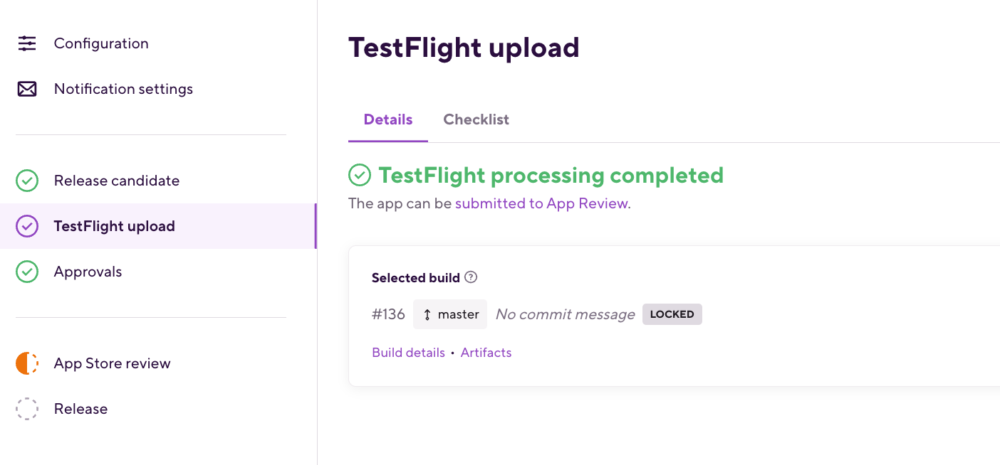

# [デプロイ]((https://devcenter.bitrise.io/en/deploying.html))

# Android
## [Play Storeへのデプロイ](https://devcenter.bitrise.io/en/deploying/android-deployment/deploying-android-apps-to-bitrise-and-google-play.html)

**前提条件**
- Google PlayコンソールでAPI accessの設定とアプリを登録
- API access設定で作成されるService account JSONファイルをBitrise側（Code Signing & FilesのGENERIC FILE STORAGEに）登録、もしくは独自のValutなどのシークレット管理ツールで保存。

デプロイワークフローに`Google Play Deploy`ステップを入れます。

- Service account JSONファイル
- Package Name：パッケージ名
- Track: リリーストラックの設定(internal, alpha, beta, production)

- 成果物のタイプ（apkとAppBundle）に問わず、デプロイ方法は同じです。`App file path`にパス指定するだけです。複数の成果物がある場合、'\n'や'|'記号で分割します。

また、AppBundleをAPKに変換する[`Exporting a universal APK`ステップ](https://devcenter.bitrise.io/en/deploying/android-deployment/exporting-a-universal-apk-from-an-aab.html)もあって、実機デバイステストに役立ちます。

## [Firebaseへのデプロイ-Android](https://devcenter.bitrise.io/en/steps-and-workflows/workflow-recipes-for-android-apps/-android--deploy-to-firebase-app-distribution.html)

**前提条件**
- Firebase側で、すでに既存のFirebaseプロジェクトが存在し、パッケージ名が登録されている状態。[参照](https://firebase.google.com/docs/app-distribution/android/distribute-console?apptype=apk)
- ローカルで firebase login:ci を実行して、Firebase からトークンを取得して、FIREBASE_TOKENという名前でBitriseにSecretとして追加します。
- Firebaseプロジェクトの General Settings ページから Firebase App ID を取得し、 `Firebase App Distribution` ステップ に入力します。

リリースビルドをデプロイしたい場合は、Bitriseでリリースモードのコード署名を設定して、リリースAPKをビルドして署名することが必要です。

[サンプルワークフロー](https://devcenter.bitrise.io/en/steps-and-workflows/workflow-recipes-for-android-apps/-android--deploy-to-firebase-app-distribution.html)

## [Huawei AppGalleryへのデプロイ](https://devcenter.bitrise.io/en/deploying/android-deployment/deploying-apps-to-huawei-appgallery.html)
Huawei AppGalleryへデプロイするための手順はリンクのページをご覧ください。

# iOS
Export method(エクスポートメソット)
- development: 開発用、あらかじめにProvisioning Profile（Apple developer portal）にUDIDを登録しているテストデバイスのみに、インストールできます。
- ad-hoc: テスト用、Distribution署名書を用いたビルド。Apple developer portalにUDIDを登録していないデバイスでも`Deploy to Bitrise`ステップの`public install page`からipaのインストールが可能です。
- app-store: TestflightとApp storeに配布用。

## [App Store Connect/Testflightへのデプロイ](https://devcenter.bitrise.io/en/deploying/ios-deployment/deploying-an-ios-app-to-app-store-connect.html)

App Store Connectにデプロイするためのステップは二種類あります：
- Deploy to App Store Connect - Application Loader: .ipaまたは.pkgバイナリファイルをApp Store Connectにアップロードするだけのステップ。
- Deploy to App Store Connect: アップロード以外、下記の設定もできます：
    - App Storeにアプリをアップロードしてレビューを受ける。
    - 3つの異なるプラットフォーム（iOS、OS X、AppleTVOS）のアプリをサポートしています。
    - スクリーンショットやリリースノートなどのとアプリのメタデータをバイナリと一緒にアップロードするよう設定できます。

[サンプルワークフロー](https://devcenter.bitrise.io/en/steps-and-workflows/workflow-recipes-for-ios-apps/-ios--deploy-to-app-store-connect---testflight.html)

## [Firebaseへのデプロイ-iOS](https://devcenter.bitrise.io/en/steps-and-workflows/workflow-recipes-for-ios-apps/-ios--deploy-to-firebase-app-distribution.html)

FirebaseにiOSアプリをデプロイするため、`Firebase App Distribution` ステップの設定はAndroidとほぼ同じです。

**前提条件**
- Firebase側で、すでに既存のFirebaseプロジェクトが存在し、Bundle ID名が登録されている状態。[参照](https://firebase.google.com/docs/app-distribution/ios/distribute-console)
- ローカルで firebase login:ci を実行して、Firebase からトークンを取得して、FIREBASE_TOKENという名前でBitriseにSecretとして追加します。
- Firebaseプロジェクトの General Settings ページから Firebase App ID を取得し、 `Firebase App Distribution` ステップ に入力します。

[サンプルワークフロー](https://devcenter.bitrise.io/en/steps-and-workflows/workflow-recipes-for-ios-apps/-ios--deploy-to-firebase-app-distribution.html)

## [Visudal Studio App Centerへのデプロイ](https://devcenter.bitrise.io/en/steps-and-workflows/workflow-recipes-for-ios-apps/-ios--deploy-to-visual-studio-app-center.html)
Visudal Studio App Centerへデプロイするための手順はリンクのページをご覧ください。

# [Release Management(Beta)紹介](https://devcenter.bitrise.io/en/deploying/release-management.html)
BitriseのRelease Managementはアプリのリリースプロセスの管理ツールです。

リリースに関連するすべてのタスクのワンストップソリューションとしての役割も果たします。
リリースブランチの作成やTestFlightへのリリース候補のアップロードなど、リリース関連のタスクを全てBitriseのRelease Managementツールで処理できます。

Beta版は現在全てのユーザに公開しているので、ぜひご使用後のご感想をお聞かせ下さい。

**制限**
- 現状では`Native iOSプロジェクト`と`クロスプラットフォームのiOSプロジェクト`が対象です。
（プロジェクトタイプが`iOS`、もしくは`react-native`, `flutter`）

- Release Managementを使うには、ワークフローで作成した`.xcarchive`ファイルからipaを作成するので、`Xcode Archive & Export for iOS` ステップと `Deploy to Bitrise.io - Apps, Logs, Artifacts` ステップの使用は強く推薦します。

ダッシュボードの上のリンクからRelease Managementに遷移し、iOSプロジェクトを選択します。

Add new App store releaseボタンをクリックし、リリースを作成します。

App を選択して、Release versionを入れます。

リリースブランチとリリースワークフローを選択し、アップロード方法を選択します。
- 自動アップロード：最新の成功ビルドが自動的に選択されます。
- 手動アップロード：下に成功ビルドリストが表示され、Lock as RCボタンで対象を選択します。

リリースを作成した後、ConfigurationタブのTimelineで各タスクの日程設定ができます：

また、Release managementはSlackとの連携も対応しています。
NotificationタブでSlack webhookを設定すると、自動的にリリースの進捗メッセージがSlackチャネルに届きます。

[連携方法](https://devcenter.bitrise.io/en/deploying/release-management/configuring-a-release.html#enabling-slack-notifications-for-release-management-events)

次にTestflight uploadタブに行って、アプリをTestflightにアップロードします。

成功した画面

Approvalsタブでは、社内のリリースプロセスで承認が必要な関係者やチームメンバーごとにタスクを作成することができます。

現状では簡単なTodoリストのような形ですが、今後はJiraなどの課題追跡システムとの連携を予定しています。

タスクが完了したら、チェックを入れます。

App Store reviewタブに、App storeにレビューを出す前の諸々設定ができます。

リリース日の設定画面

最後に、App storeからのレビューが通りましたら、
リリースタブに行ってリリースを行います。

# [Shipの紹介](https://devcenter.bitrise.io/en/deploying/deploying-with-ship.html)

ShipはBitriseが提供するもう一つのデプロイメントソリューションです。
iOSとAndroid両方のアプリの配布、バージョン履歴、メタデータ管理などの機能があります。
今後Release Management側にShipの機能を取り入れる予定なので、日程未定ですが、こちらのツールは廃止予定です。