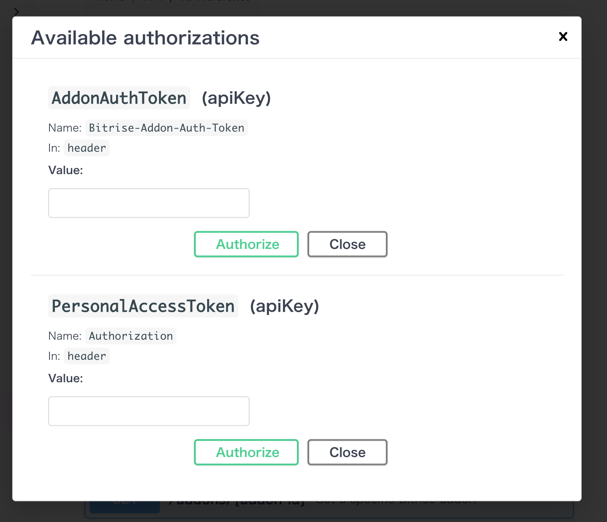

# Insights、セキュリティ関連やサードパーティサービス統合などのトピック

# Firebase Test Lab
現状、Flutter Test Lab では Flutter プロジェクトをサポートしていませんが、
[公式サイトにワークアラウンド](https://firebase.google.com/docs/test-lab/flutter/integration-testing-with-flutter)はあります。

**前提条件**
- Flutter の integration test を書く
- **APK** と **iOS test zip** ファイルを作成
- Android instrumentation テストと iOS XCTests を Firebase test lab で実行

また、先週いただいたAWS device farmに関するご質問の返答：
# AWS device farm

## Device Farmで試験する時にはどういうdistribution methodを使う?

**Ad-hocのDistribution メソット**が一番妥当だと思います。

こちらの[ドキュメント](https://docs.aws.amazon.com/devicefarm/latest/developerguide/working-with-private-devices.html)によると、
AWS device farmは二種類のデバイスを提供しています。

- `プライベートデバイス` (専属デバイスをAWS US West(Oregon)リージョンにのみ提供中）
- `パブリックデバイス`
### プライベートデバイス
プライベートデバイスを使う場合、distribution method が `development` でコード署名したアプリでも実行可能ですが、予めに Device Farm の `ListDeviceInstances` という API で UDID リストを取得し、Apple developer portalにテストデバイスとして登録しておく必要があります。

また、プライベートデバイスの設定に、`skip app-resigning` という項目があり、skipを選択すると Device farm はアプリを再署名をしません。[詳細](https://docs.aws.amazon.com/devicefarm/latest/developerguide/skip-app-re-signing-on-private-devices.html)

> You can skip app re-signing when you create a remote access session or a test run. This can be helpful if your app has functionality that breaks when Device Farm re-signs your app. For example, push notifications might not work after re-signing.

### パブリックデバイス
パブリックデバイスを使用する場合、UDIDは毎回変わるので、テストデバイスの事前登録は不可能です。
そのため、Distribution method は Ad-hoc や App-storeしか選べません。

また、AWS Device Farmはパブリックデバイスにインストールするアプリを必ず再コード署名するので、プッシュ通知が動作しなくなると書いてあります。
> Device Farm always re-signs your app on the Android and iOS platforms for public devices.

## Device farm のテストワークフロー作成
一応 [AWS Device Farm runner](https://github.com/lautarochiarle/bitrise-aws-device-farm-runner) というコミュニティーステップはありますが、三年前から更新されていないので、最新の仕様に合ってない部分があると思います。

このステップをフォークして、最新の仕様を参照しながらステップを作り直すことが必要かと。

### 参照
- [FlutterプロジェクトにAWS device farmの統合](https://testfairy.com/blog/running-flutter-tests-on-aws-device-farm/)
- [AWS Device Farm API](https://docs.aws.amazon.com/devicefarm/latest/APIReference/Welcome.html)

# [VPN設定](https://devcenter.bitrise.io/en/builds/connecting-to-a-vpn-during-a-build.html)
BitriseのマシンをVPN経由でプライベートのGitレポジトリやAPIサーバーに繋げることができます。

そうするために、まずローカルネットワークのアドレス空間がBitrise仮想マシンのアドレス空間と衝突していないことの確認が必要です。

[設定方法](https://devcenter.bitrise.io/en/builds/connecting-to-a-vpn-during-a-build.html)は三つあります：

- Connect to OpenVPN ステップを使って、あらかじめ OpenVPN サーバーを構築し、証明書ファイルや秘密鍵をエンコードしておく
- Script ステップを使って、Strongswan VPN を設定
- Cisco VPN Connect ステップを使用

    - [VPNC](https://linux.die.net/man/8/vpnc) という Linux コマンドを使用
    - `Command line option` にvpncへのコマンドオプションを入力
    - `Config file content`：VPNクライアント設定用のコンフィグパス

また、御社のファイアウォールのホワイトリストにBitriseマシンのIPアドレスを追加していただく必要もあります。

[BitriseマシンのIPアドレスリスト](https://devcenter.bitrise.io/en/infrastructure/build-machines/configuring-your-network-to-access-our-build-machines.html#ip-addresses-for-the-bitrise-build-machines)

詳細はこちらの [ネットアクセス制限設定](https://devcenter.bitrise.io/en/infrastructure/build-machines/configuring-your-network-to-access-our-build-machines.html) をご確認ください。

# [API](https://devcenter.bitrise.io/en/api.html)

BitriseはAPIも公開しているので、APIでCICDプロジェクトの操作や管理が可能です。

[APIリファレンス](https://devcenter.bitrise.io/en/api/api-reference.html)
からAPIの仕様を確認できます。

テストもできるので、ぜひ試してみてください。
`Authorize` ボタンをクリックし、`AddonAuthToken` もしくは `PersonalAccessToken`を入力してからテストします。

`PersonalAccessToken` の発行方法は、プロフィル設定画面→Securityタブで行います。
- Create Tokenボタンをクリック

- トークン名と期限を設定

- APIリファランスでトークンを入力し、任意のAPIを選択して、`Try it out` ボタンをクリックしてテストします。

# Slack統合
## [統合設定](https://devcenter.bitrise.io/en/builds/configuring-build-settings/configuring-slack-integration.html)

BitriseはSlackとの統合をサポートしています。`Send a Slack message` ステップを使って、ユーザー、グループ、チャンネルなどにSlackメッセージを送信します。
また、メッセージをカスタマイズしたり、添付ファイルを含めたり、ビルドページに誘導するボタンをリンクさせたりすることもできます。

- シークレットタブに、Slack webhook URL、またはSlackボットユーザーのSlack APIトークンを登録
- ワークフローに、`Send a Slack message` ステップを追加して、先のURLやトークンをパラメーターに入力

- Slackメッセージに関するカスタマイズ内容を入力
    - ターゲットチャンネル、グループ、またはユーザー名
    - メッセージのテキスト
    - メッセージに使用するボットのユーザー名
    - 添付ファイル
    - リンクボタン
    - ...
などの設定ができます。
## サンプルワークフロー
### [ビルド結果のSlack通知](https://devcenter.bitrise.io/en/steps-and-workflows/generic-workflow-recipes/-ios-android--send-build-status-to-slack.html)

### [ビルドArtifactのQRコードのSlack通知](https://devcenter.bitrise.io/en/steps-and-workflows/generic-workflow-recipes/-ios-android--send-qr-code-to-slack.html)

ビルドArtifactのインストールURLのQRコードをSlackメッセージに添付する方法：
- `Deploy to Bitrise.io` ステップをビルドステップの後ろに追加
- `Create install page QR code` ステップを追加
- `Send a Slack message` ステップを追加
    - `Slack Webhook URL`：例えば、$SLACK_WEBHOOK。
    - `Target Slack channel, group or username`：対象のSlackチャンネル、グループ、またはユーザー名を入力、例えば #build-notifications
    - `A URL to an image file that will be displayed as thumbnail`：サムネイルとして表示される画像ファイルのURLを設定、例えば$BITRISE_PUBLIC_INSTALL_PAGE_QR_CODE_IMAGE_URLです。

# [Insights](https://devcenter.bitrise.io/en/insights.html)
Insights は、去年12月にリリースした Bitrise ビルドのパフォーマンスメトリクスを追跡できるモニタリングツールです。
## [機能紹介](https://devcenter.bitrise.io/en/insights/getting-started-with-insights.html)

- Overview：該当workspaceに登録されているアプリらの各メトリクスの概要。右上で時間の単位や期間を変更できます

- Dashboard：トラッキングしたいメトリクスを独自のダッシュボードにカスタマイズできます
- Bottlenecks: 直近七日間のビルド/テスト/クレジットなどのトピックスのボトルネック

- Explore： [利用可能なメトリックス](https://devcenter.bitrise.io/en/insights/available-metrics-in-insights.html)

    - Builds
    
    - Tests
    
    - Credits
    

メトリクスを**ダッシュボード**と**アラート**に追加し、トラッキングすることができます。

## チュートリアル動画
- [ダッシュボート紹介](https://www.youtube.com/watch?v=W-AhysdXx_Q)
- [アラート紹介](https://www.youtube.com/watch?v=CzGYTgTqn-U)